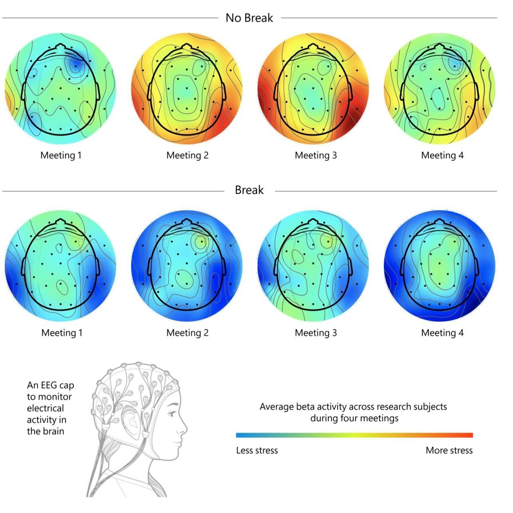

# EEG-Signal-Analysis

Electroencephalography (EEG) is a technique for continuously recording brain activity in the form of brainwaves. EEG is commonly used because it provides a noninvasive, easy, and inexpensive method to measure neural activity at a high resolution. EEG analysis is used a lot in evaluating brain disorders, especially epilepsy or other seizure disorders. It is also used in brain-computer interfaces (BCIs). EEG is also used in sleep research, anesthesia research, and cognitive science research.

EEG devices are composed of different electrodes that are placed on the scalp. These electrodes are represented as channels using a montage. There are different types of montages.

EEG signals can be seen as a time series, since EEG recordings measure brain activity over a specific time period. The figure below compares the brain activity with `No Breaks` at work and then with `Breaks` monitored by and EEG cap.
